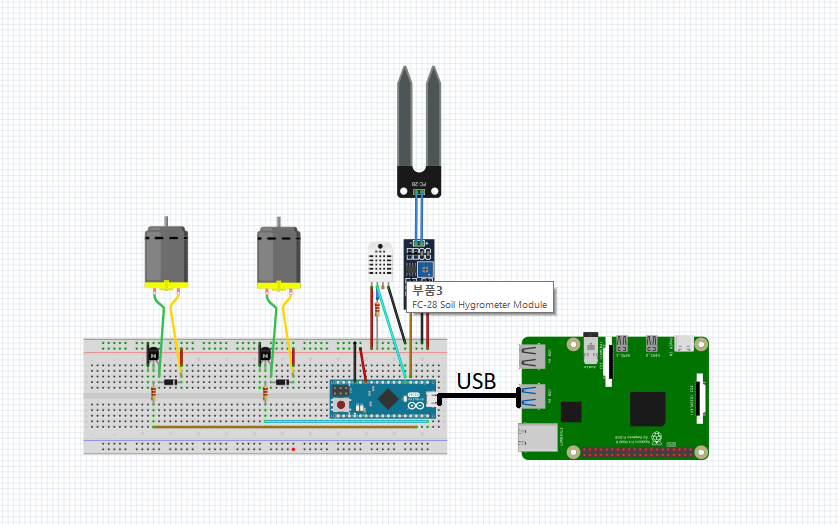

# Am2ent

In our project we used various sensors to control the environment around a plant.
Some of the things that our project can do are: 
- Get updates regarding to soil moisture, air temperature and humidity;
- Adapt the soil moisture according to a set limit;
- Ventilate the environment to recirculate the air;

We used MQTT protocol to send data from/to the android application to/from the raspberryPi board which communicate with an arduino board that uses sensors to collect environmental data and actions our actuators.

## Video Demonstration

[(Watch the demo on YouTube)][demo-yt]

## Schematics

## Pre-requisites

- RaspberryPi 4 board
- Arduino Micro
- Android Studio 2.2+
- MQTT cloud broker (we used HiveMQ)
- The following individual components:
    - 1 DHT11 sensor
    - 1 soil moisture sensor
    - 1 submersible pump
    - 1 dc motor with a fan
    - 2 transistors
    - 3 resistors
    - 2 inverter diodes
    - jumper wires
    - 1 breadboard
    - lots of duct tape 
    - fancy box
    - some cardboard

## Setup and Build

To setup, follow these steps below.

1. Create a mqtt cloud broker 
2. Copy the credentials and the topics names to Config.kt
3. Install the app on your device
4. Upload the programs to Arduino and RaspberryPi 
5. Build the system according to schematics

![Radu toarna apa][demo-gif]

## Running

1. Place the plant pot and insert the soil moisture sensor
2. Place the fancy box on top of the plant
3. Run application on mobile
4. Run application on raspberry
5. Check the application to see the environmental values
6. Set the desired soil moisture or ventilation time and watch the system do it's magic

[demo-yt]: https://www.youtube.com/watch?v=lCdlz7tk_oI&list=PLWz5rJ2EKKc-GjpNkFe9q3DhE2voJscDT&index=1
[demo-gif]: raduApa.gif
